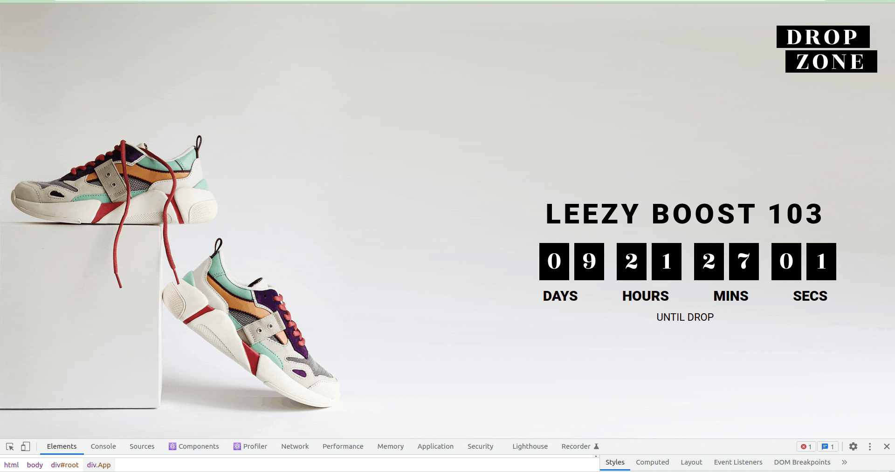

# Drop Zone
Diff technical interview question.

### Option B
1. The solution matches the mock ups.
1. The countdown timer decrements in real time.
1. The timer counts down to midnight to a configurable date.
   1. Declare a `date` variable that can take a date of format `MM/DD/YYYY`.

## Final product



## Setup

Install dependencies with `npm install`.

## Running Webpack Development Server

```sh
npm start
```
